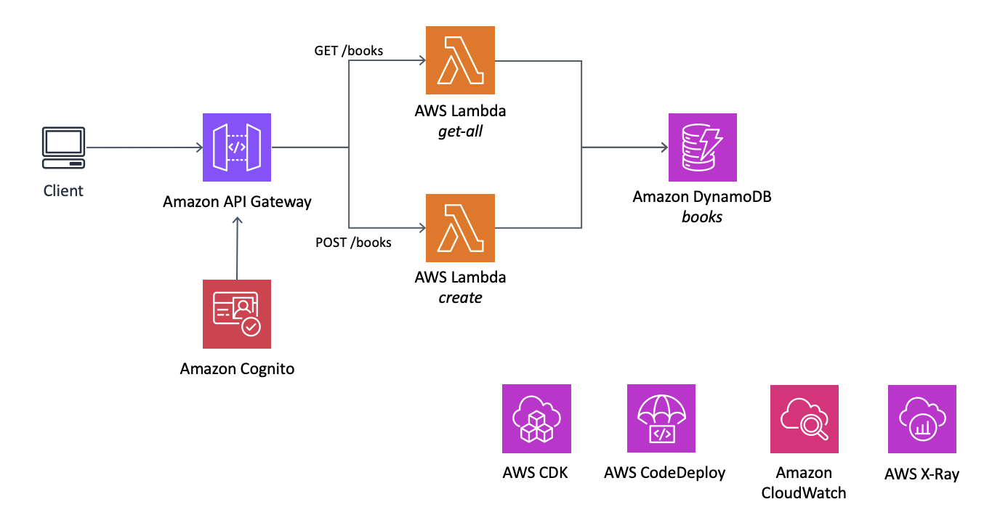
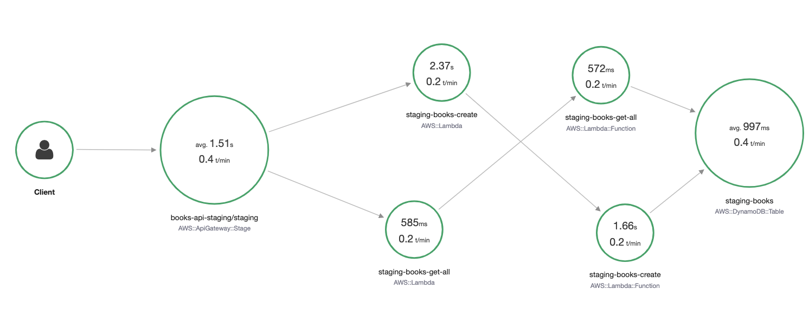
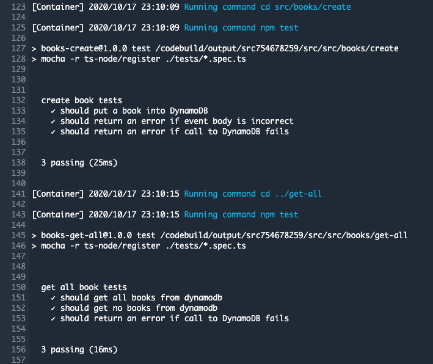
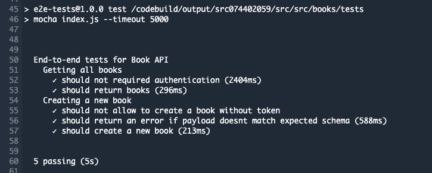
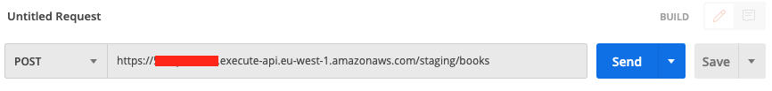
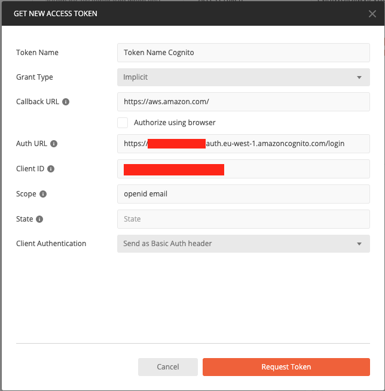
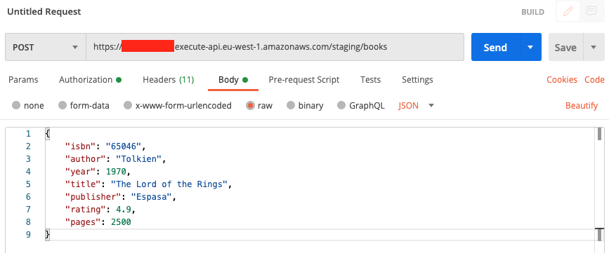

# API Gateway using AWS SAM <!-- omit in toc -->

This repository contains a Books API powered by Amazon API Gateway, AWS Lambda and Amazon DynamoDB. Involved resources are defined and provisioned using AWS SAM.

For CI/CD it assumes there are two environments: staging and production. Pipeline is implemented using AWS CDK.

**Table of contents:**

- [Architecture](#architecture)
- [Requirements](#requirements)
- [Project Structure](#project-structure)
- [Using SAM to deploy the app](#using-sam-to-deploy-the-app)
- [Testing your lambda locally](#testing-your-lambda-locally)
- [Monitoring](#monitoring)
- [Tracing](#tracing)
- [CI/CD](#cicd)
- [Getting a token to manually test the API](#getting-a-token-to-manually-test-the-api)

## Architecture

Application is an RESTful API around the book resource. It currently supports an endpoint for registering new books and another one for retrieving them. This API is implemented using Amazon API Gateway and AWS Lambda where authentication is provided by Amazon Cognito. Amazon DynamoDB is the chosen data store.



## Requirements

* Node.js 12 or above
* npm 6 or above
* [AWS SAM CLI 0.40.0](https://docs.aws.amazon.com/serverless-application-model/latest/developerguide/serverless-sam-cli-install.html). It requires you to set AWS credentials so that it can make calls to AWS services on your behalf.
* Set the AWS region you want to deploy this application to. You can do so through `aws configure` or `AWS_DEFAULT_REGION` environment variable.

## Project Structure

```tree
aws-api-gateway-sam
 |- events        // HTTP request samples to test our app locally using sam local
 |- images        // images for this README
 |- pipeline      // CDK app defining a CI/CD pipeline for our API
 |- src           // source code
 |- template.yml
```

AWS SAM template is defined in the root directory through a YAML file. It defines:

* An input `Parameter` that specifies to which environment we are going to be deploying to.
* A `Condition` that based on the parameter above determines if this is a deployment to production or not. This is needed as different resources and configurations will be used based on the environment.
* `Global` section to define those parameters that are common to multiple resources in the template.
* `Books` API that glues together the configuration for our API including monitoring, tracing or authorization methods.
* Lambda function called `CreateBook` which is responsible for grabbing book attributes from the HTTP request and storing them into a DynamoDB table. Configuration:
  * Built-in IAM policy that allows this function to perform write operations into the DynamoDB table.
  * Being able to create books is an action that is only reserved to logged users and hence this endpoint defines authorization through an Amazon Cognito User pool.
* `GetAllBooks` function peforms an scan over the book table and return all results back to the client. Considerations:
  * Read permission over books table is granted through another built-in IAM policy namely `DynamoDBReadPolicy`.
  * Geting all books is an open operation that everyone can call and hence no authentication is defined.
* For both lambda functions, the deployment behaviour is different based on the target environment:
  * For staging, new versions are deployed to an alias named after the environment with a bluen/green approach.
  * For production, we use a more conservative approach that allows us to gradually shift traffic towards the new version. During the time this deployment lasts, each function has a CloudWatch alarm (with suffix `AliasErrorMetricGreaterThanZeroAlarm`) that monitors if the new version of the function throws errors, performing a rollback in case it does.
  * Only for the function creating a new book, its deployment performs a check (or smoke test) for the new version before shifting traffic to it through a lambda function (`CreateBookPreTraffic`). If it fails, traffic is not routed to the new version and deployment is considered failed.
* Aforementioned DynamoDB table: `Books`.
* Users that are allowed to create new books need to be registered in the `CognitoUserPool`. In order to get a token, we need to define a client and domain (instructions to manually get a token using Postman are explained below). Aformentioned client only supports the OAuth implicit grant.
  * In order to perform automated tests in staging and given how implicit grant works (through a web browser), only for this environment we will enable username and password auth so that we can get a token programatically and hence, be able to fully tests our endpoints. This also forces us to allow the `aws.cognito.signin.user.admin` scope (only scope that can be obtained when obtaining an access token through Cognito SDK).

## Using SAM to deploy the app

Packaging and deploying the app to AWS is relatively straight forward since all configuration is defined in `template.yml`.

* Package your lambda functions and store them safely in a S3 bucket. This command outputs the corresponding version of your `template.yml` pointing to where your artifacts have been stored in S3.
  
  ```sh
  sam package --s3-bucket my-artifacts-bucket --s3-prefix my-prefix --output-template-file out.yml
  ```

* Deploy a new version of your app using the artifacts the command above just generated (using staging as the target environment for demo purposes):

  ```sh
  sam deploy --template-file out.yml --stack-name my-stack-staging --parameter-overrides ParameterKey=Environment,ParameterValue=staging --capabilities CAPABILITY_IAM
  ```

  You can monitor how the deployment is happening through AWS CodeDeploy as the above will create a new application in this service alongside a deployment group for your lambda.

These two commands will be used in both `Build` and `Deploy` steps of our pipeline.

## Testing your lambda locally

Create a docker network and run a local dynamodb container in it:

```sh
docker network create my-network
docker run -d --network my-network -v "$PWD":/dynamodb_local_db -p 8000:8000 \
    --network-alias=dynamodb --name dynamodb \
    amazon/dynamodb-local -jar DynamoDBLocal.jar -sharedDb
```

Create the following table in the local DynamoDB:

```sh
aws dynamodb create-table --table-name books \
    --attribute-definitions AttributeName=isbn,AttributeType=S \
    --key-schema AttributeName=isbn,KeyType=HASH \
    --endpoint-url http://localhost:8000 \
    --provisioned-throughput ReadCapacityUnits=5,WriteCapacityUnits=5
```

Check previous step ran successfully:

```sh
aws dynamodb list-tables --endpoint-url http://localhost:8000
aws dynamodb describe-table --table-name books --endpoint-url http://localhost:8000
```

Finally, test your function with a dummy event (that can be generated with `sam local generate-event sqs receive-message`):

```sh
sam local invoke CreateBook -e events/create-book-request.json --env-vars events/env.json --debug-port 5858 --docker-network my-network
sam local invoke GetAllBooks -e events/get-all-books-request.json --env-vars events/env.json --debug-port 5858 --docker-network my-network
```

Notice that our lambda functions will point to the local DynamoDB container for the command above through its HTTP layer. Condition is based on `AWS_SAM_LOCAL` which automatically gets set by `sam` when executing `local` commands. Similarly, integration with AWS X-Ray is only performed outside local environment.

A very similar approach using Docker will be taken to perform end-to-end tests for our lambda function and its integration with DynamoDB.

## Monitoring

AWS SAM CLI allows to monitor any lambda function given its logical id within a stack or its name as we would visualize them using Cloudwatch. For ie:

```sh
sam logs -n CreateBook --stack-name BooksApiStaging --tail
```

## Tracing

Once we start interacting with our API through the two available endpoints, traces will be stored in AWS X-Ray since `TracingEnabled` was set to `true` in the definition of our `BooksApi` in `template.yml`.

By navigating through the AWS console to AWS X-Ray, we can load the service map of our API and look for application issues, bottlenecks or specific areas that need improving.



## CI/CD

```sh
Source -> Build -> Staging (Deploy + Test) -> Production (Manual approval + Deploy)
```

Stages and actions are implemented using AWS CodePipeline, AWS CodeBuild and AWS CodeDeploy (behind the scenes through `sam deploy` command).

Pipeline itself is defined and provisioned by [AWS CDK](https://docs.aws.amazon.com/cdk/latest/guide/home.html) using Typescript.

To get it provisioned follow these steps:

* First, install AWS CDK Toolkit:

  ```sh
  npm install -g aws-cdk
  ```

* Then, fetch dependencies and provision pipeline:

  ```sh
  cd pipeline
  npm i
  npm run build
  cdk deploy
  ```

  There will be a summary of security-related changes that needs to be approved to continue with the CloudFormation template creation.

NOTES:

* This step needs to be implemented only once when starting to work on this project.
* Artifacts generated by the pipeline are stored in an Amazon S3 bucket called `ci-cd-pipeline-artifacts-{accountId}`.
* Artifacts which are specific for our application are stored in an Amazon S3 bucket called `books-api-artifacts-{accountId}`.
* These buckets are created by our CDK script and hence, they cannot exist before running it.
* To successfully connect to Github:
  * You must create a GitHub connection ([click here to learn how](https://docs.aws.amazon.com/codepipeline/latest/userguide/connections-github.html))
* Build stage doesn't only generate our API artifacts, it also run a suite of unit tests for our AWS Lambda functions.
* Change the variables `gitRepo`, `gitOwner` and `gitBranch` based on your git config.


  <p align="center">
    
  </p>

* Once the application is deployed in staging, end-to-end tests are executed in a automated way. These tests interact directly with the provisioned app. Certain paramters such as API endpoint or dynamodb table name are made available to this action through CloudFormation Outputs.

  <p align="center">
    
  </p>

## Getting a token to manually test the API

Any user that wants to create books using the API directly, needs an OAuth2 token that grants access to the operation.

Since `template.yml` took care of provisioning all the necessary components from an infrastructure point of view, the only step left is to create such user and create a book on his behalf:

1. Navigate to Cognito using the AWS console and choose "Manage User Pools", then the pool you want to create the user for (`staging-books-api-user-pool` or `production-books-api-user-pool`).
2. Go to "App client settings" under "App integration" and note down App client id and callback URL. Similarly, navigate to Domain name and make of a note of it (`book-api-{env}-{accountId}`).
3. Open the Postman app (you can get it [here](https://www.postman.com/)).
4. Configure a new request: POST HTTP method and URL of our REST API.

  

5. In the authorization tab, select "OAuth 2.0" type, click on "Get New Access Token" and fill up the form with the values you took before:
  
  <p align="center">
    
  </p>

6. First time, you will need to sign up by introducing email and password. You would need to confirm the user which you can do directly from the Cognito console in the "Users and groups" page. Going forward, you would only need to sign in as the user already exists.

7. Upon a successful signing in, you are given a token that you can attach directly to the HTTP request using the Authorization header.

8. At last, go to the Body tab and enter the book you would like to create according to the schema defined in our functions (remenber to change the content-type of the request body to raw-JSON), click Send and all being well you should receive a  201 response code.

  

## Want to contribute? <!-- omit in toc -->

Check our [contribution guidelines](CONTRIBUTING.md) before submitting a pull request. Any contribution must be done to the `develop` branch.

## Security <!-- omit in toc -->

See [CONTRIBUTING](CONTRIBUTING.md#security-issue-notifications) for more information.

## License <!-- omit in toc -->

This library is licensed under the MIT-0 License. See the LICENSE file.
